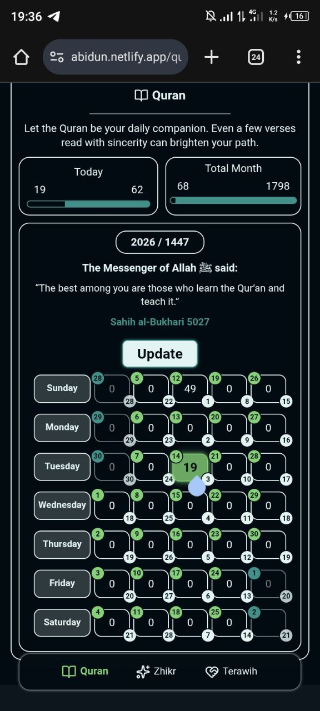
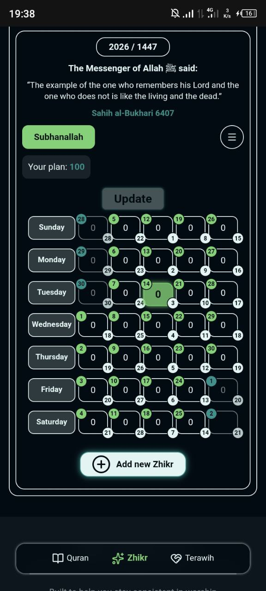
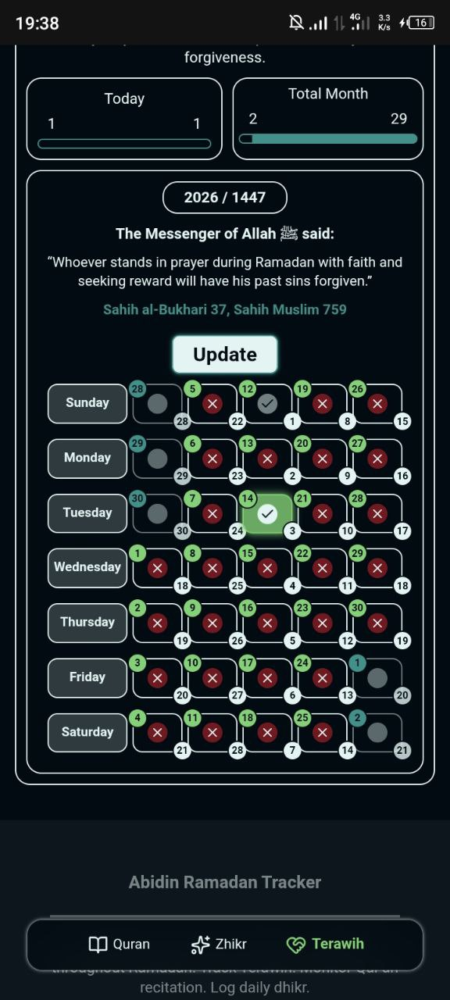

# Abidin Remedan Tracker

## 📌 Overview

**Abidin Ramadan Tracker** is a web app that helps Muslims track their daily Ramadan worship, including **Quran reading, Terawih prayers, and Azkar (remembrance of Allah)**. Stay consistent, monitor progress, and strengthen your connection with Allah during this blessed month.

## Screenshots

| Quran Page                             | Zhikr Page                             | Terawih Page                               |
| -------------------------------------- | -------------------------------------- | ------------------------------------------ |
|  |  |  |

## ✨ Features

- **Daily Quran Tracking**
- **Zhikr Daily Tracking with Specified Amount**
- **Daily Terawih Tracking**:
- **Add Custom Zhikr According To Your Need**
- **Responsive Design**
- **Beautiful Ui**:

## 🛠️ Technologies Used

### Frontend:

- **React** : For ui building and front end routing
  
- **Vite** : For Building and bundling
  
- **Tailwind CSS** : For Styling Ui
  

### Backend:

- Express.js
  
- NodeJS
  

### Database:

- Mongodb
  

## 🚀 Installation

1. Clone the repository:

```bash
git clone https://github.com/abdu-selam/remedan-tracker.git
```

2. Navigate to the project directory:

```bash
cd remedan-tracker
```

3. navigate to front end and back end 

**For Frontend**

```bash
cd client
```

**For Backend**

```bash
cd server
```

4. install needed packages for both front end backend

```bash
npm install
```

5. open app in `http://localhost:5173` or given react host

<span style="color: red;">⚠ make sure you have been added proper environment variables for both frontend and backend</span> 

## Environment Variables

Frontend Envirenment is

```env
VITE_API_URL=<your_backend_url>
```

Backend Envirenment is

```env
PORT=<your_server_port>
NODE_ENV=<development_or_production>

MONGODB_URL=<your_mongodb_uri>

JWT_ACCESS=<your_access_token_secret>
JWT_REFRESH=your_refresh_token_secret

CLIENT_URL=<client_url>

EMAIL_KEY=<brevo_api_key>
```


## 📁 Project Structure

```
calculator-app/
├── client         # Complete React frontend
└── server        # Complete Express Backend
```

## 💡 Future Improvements

- Add Zhikr counter
- Daily Hadis 

## 🤝 Contributing

Contributions are welcome! Open an issue or pull request for new features or improvements.

## 📝 License

This project is open-source and free to use for personal or community purposes.

## 🙏 Message

May this app help you strengthen your connection with Allah, maintain consistency in worship, and make your Ramadan spiritually fulfilling.